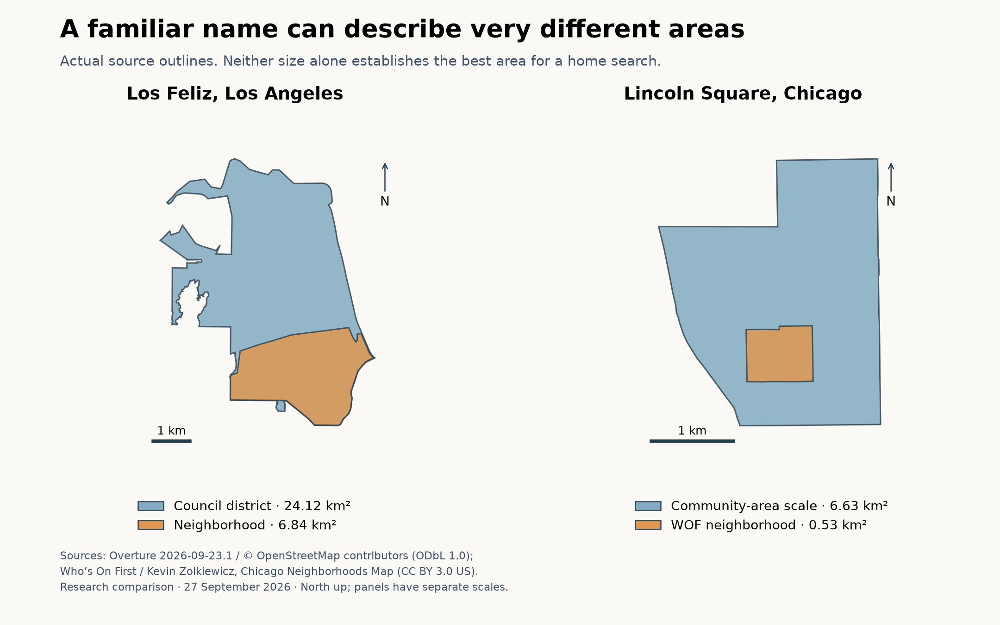

# Component 1: what does a neighborhood name mean?

Inspected 2026-09-27. **Research findings and a proposal for review; no provider or product architecture selected.**

We can find useful neighborhood names and boundaries in free sources. We cannot safely treat every record called a neighborhood as the same kind of place. In this sample, the biggest problems were differences in geographic meaning, incomplete names, and missing outlines—not a lack of polygons overall.

## Five examples

Areas below were calculated from downloaded polygons, rounded to two decimals. They measure the source's outline, not quality, residential land, or the area a person should search. See the [evidence and methods](neighborhood-evidence.md).

| Example | What the records actually show | What a home seeker needs to know |
|---|---|---|
| **Los Feliz, Los Angeles** | Zillow, CDND, Who's On First (WOF), and Overture have similarly sized neighborhood outlines: **6.80–6.84 km²**. Overture also has a **24.12 km² neighborhood council district**. | “Los Feliz” and “Los Feliz Neighborhood Council District” should remain distinct records. Similar names do not establish equivalent areas. |
| **Sherman Oaks, Los Angeles** | Zillow: **25.63 km²**; CDND neighborhood: **23.75 km²**; WOF: **22.50 km²**; Overture council district: **22.46 km²**. WOF's source is explicitly a city neighborhood-council dataset, although its displayed name is simply Sherman Oaks. | A clean display name can hide the boundary's original purpose. Keep that purpose visible in the supporting explanation. |
| **Bungalow Heaven, Pasadena** | CDND has a **0.92 km² neighborhood-association outline**. Overture has a named point but no corresponding area in this query. The nine Zillow records tagged Pasadena use broader regional names; none is Bungalow Heaven. | A recognizable local name can be missing from a national boundary list. A point is useful for discovery but cannot support polygon-based statistics by itself. |
| **Lincoln Square, Chicago** | Zillow: **0.57 km²**; WOF: **0.53 km²**. CDND community area 4 and Overture: **6.63 km²**. The larger outline is approximately **12.4 times** the area of WOF's neighborhood. | A statistic for the whole community area must not be presented as describing only the smaller neighborhood around Lincoln Avenue. |
| **Ames, Iowa** | Zillow contains **18 named polygons** tagged Ames. CDND's city list omits Ames. The Overture query found **six place points and no area polygons**; several names describe university areas. A WOF hierarchy search located Ontario as a point, with current status unknown. | Newer sources do not automatically provide better coverage. An explicit fallback policy is necessary outside well-covered cities. |

The figure compares actual outlines, with north up and separate local scales. The smaller area is not automatically the “correct” one. The point is that these are different geographic objects. Source credits and terms are in the [evidence appendix](neighborhood-evidence.md#figure-and-reuse).

## File quality matters as much as provider reputation

The inspected CDND files contain 114 Los Angeles neighborhood polygons, 99 Los Angeles association/council polygons, 84 Pasadena association polygons, and 77 Chicago polygons. These counts describe different units and cannot be compared as coverage percentages.

Two concrete cleanup requirements appeared:

- The Los Angeles association/council file's only name field contains `00:00:00.000` for all 99 records. Two independent file readers produced the same result. This particular file needs repair or a source join before names can be used.
- Chicago's neighborhood field contains numeric community-area codes rather than names. The [city's source data](https://data.cityofchicago.org/resource/igwz-8jzy.json?%24select=community%2Carea_numbe&%24where=area_numbe%3D4) confirms code 4 is Lincoln Square. That mapping must be explicit.

These are findings about specific inspected files, not a claim that all CDND files have those problems.

## How cross streets help

A cross-street label can make the recommendation specific without pretending that everyone agrees on a boundary. For example:

> **Los Feliz, Los Angeles — start around Vermont Avenue & Franklin Avenue.**
> This is a candidate starting point for exploring the neighborhood. A home elsewhere in Los Feliz can have different surroundings. Any neighborhood-wide statistic should retain its source and geographic scope.

The [cross-street checks](neighborhood-evidence.md#cross-street-checks) separate three questions: do the roads connect, where does that connection fall relative to the source outline, and would a person actually find it a useful starting point? Map connectivity answers the first question. It does not establish pleasant walking conditions, parking, accessibility, or a desirable residential pocket. Local review remains necessary.

The [Bungalow Heaven association](https://www.bungalowheaven.org/our-history/what-is-bhna/) describes its area using surrounding streets and McDonald Park. The [City of Ames](https://www.cityofames.org/My-Government/Departments/Planning/Historic-Preservation/Local-Landmarks-Historic-Districts) separately describes an Old Town historic district. Such local sources help explain names and purposes; a historic designation must not silently become a general neighborhood definition.

## Proposed source strategy

Use sources for complementary roles rather than declaring one national boundary file authoritative:

| Role | Proposal | Tradeoff |
|---|---|---|
| Recognizable names | Compare Overture and WOF; add verified local names. | Duplicate names, missing places, and point-only records require checks. |
| Useful outlines | Keep CDND/local definitions and national alternatives with their stated purpose. | Some cities need source-specific cleanup; alternate outlines increase maintenance. |
| Historical comparison | Retain Zillow as a benchmark and coverage candidate while clarifying reuse terms. | Useful coverage can be old; this is not a current Zillow service. |
| Cross streets | Verify connections using OSM or Overture transportation, then review their usefulness locally. | Public query services can be slow or rate-limited. An operational tool needs a dependable access plan. |
| Measurements | Record separately the area each statistic measures. | A neighborhood name or anchor cannot magically make coarse statistics precise. Component 2 will address this. |
| Missing coverage | Show a named place with an explicitly missing outline, or report outside coverage. | Do not manufacture a boundary or substitute an unrelated council district just to fill a map. |

Overture's inspected polygons all trace to OpenStreetMap. Their agreement with OSM is therefore not independent confirmation. Urban Stats also remains a useful reference rather than an independent neighborhood-boundary source: its layer uses the Zillow archive.

## The decision to discuss next

**Recommendation: make the result a named place plus one or more reviewed cross-street starting points. Treat outlines as attributed supporting context, and keep measurement geography separate.**

This follows the owner's preference for names and cross streets, but the source strategy and exact meaning of a starting point still need discussion. Before implementing this component, settle:

1. Is the cross street an exploration starting point, rather than a claim that nearby homes are suitable?
2. When sources disagree, should the default show one explained outline with alternatives available?
3. When a place has a name but no dependable outline, is a clearly labeled point sufficient for discovery?

The sample inspection is useful evidence for that discussion. It is not a nationwide coverage audit, a local endorsement of the starting points, or approval to build the matching system. The next component, once geography is agreed, is **which characteristics we can measure and explain reliably**.
