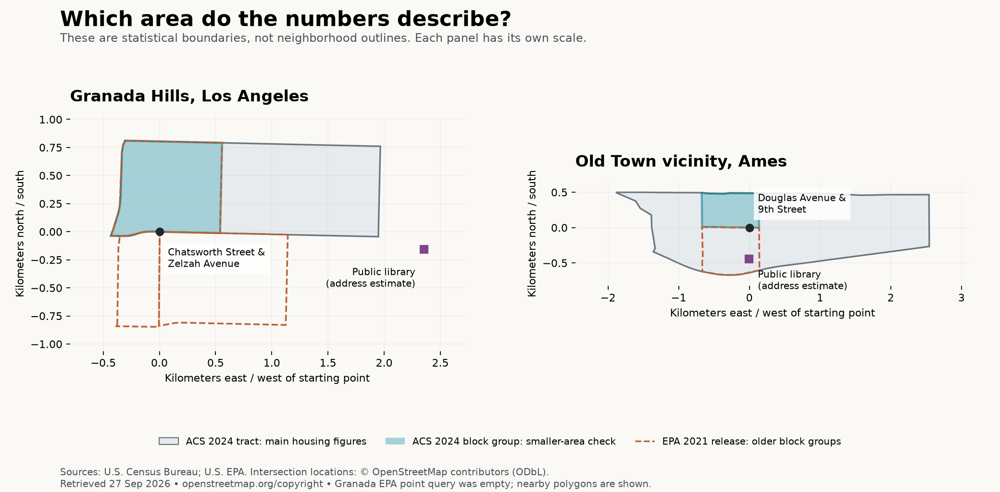

# Granada Hills and Ames: what can we actually tell a buyer?

Research snapshot: **27 September 2026**. The owner asked for Granada Hills instead of Los Feliz, then clarified that a useful result should answer practical buyer questions. The earlier emphasis on detached-home percentages was misplaced. This page now evaluates the evidence against those questions; the [full source calculations](worked-area-methods.md) remain available for inspection.

**The existing research is background, not enough to recommend either place to a household.** The next work should close a consequential buyer-information gap, rather than add more easily available area statistics. See the agreed [buyer-decision principle](buyer-decisions.md).

## The questions that matter

| Buyer question | What this exercise currently supports | What still needs evidence |
|---|---|---|
| Can I find the home I need within my budget? | Dated housing and cost context for selected Census areas | The household's home requirements and budget; suitable current options; purchase-specific recurring costs |
| Will our regular trips work? | Starting-point coordinates and older regional accessibility context | Each person's destinations, schedule, mode and appropriate route/time estimates |
| Are the things we use conveniently accessible? | One public-library address checked in each example | Which destinations matter to this household, current options and practical routes |
| Will I like the streets and surroundings? | Some coarse physical context | Direct preferences and relevant evidence about activity, noise, greenery, walking and local conditions; visits where needed |
| Could a requirement rule this out? | No household-specific conclusion | Applicable school/program eligibility, hazards, insurance, accessibility and property checks |
| Where could I start exploring? | Verified cross streets in each named area | A household-specific reason to visit that pocket and a route or visit plan |

No missing answer above means that an area fails. Granada Hills and Ames are contrasting research examples, not competing recommendations for a known household.

## Recognizable starting points

- **Granada Hills, Los Angeles:** [Chatsworth Street & Zelzah Avenue](https://www.openstreetmap.org/node/122720323).
- **Old Town vicinity, Ames:** [Douglas Avenue & 9th Street](https://www.openstreetmap.org/node/2624861615).

These are exploration starting points. They do not claim that a particular residential pocket fits someone. Census statistics describe the specific areas below, not all of Granada Hills or the exact Old Town neighborhood. The opposite side of an intersection can have a different statistical record.

Boundaries: U.S. Census Bureau ACS 2024 geography and EPA's 2021 SLD release. Intersections: © [OpenStreetMap contributors](https://www.openstreetmap.org/copyright), [ODbL](https://opendatacommons.org/licenses/odbl/1-0/).

## Keep the background in its proper role

We inspected nine ACS tables, selected EPA records and two library locations. This remains useful evidence about source access, boundaries, dates and uncertainty. It is not a proposed list of headline features.

- **Housing mix:** does not establish that a suitable home is available. Detached-home share gets no default headline or exclusion threshold.
- **Historical value and owner costs:** do not establish today's price or monthly cost for the home a buyer needs.
- **Housing age:** can prompt a condition question; it does not answer it.
- **Subscription rates:** do not tell a remote worker whether the prospective address has suitable internet service.
- **An older walkability index:** does not establish whether the household's actual walks are convenient.
- **A library address:** is useful only if that destination matters to the household; straight-line distance is not walking time.

The [methods and full comparison](worked-area-methods.md) preserve all values, sources, uncertainty and documented gaps. No evidence has been replaced with invented prices, trips or descriptions of neighborhood character.

## A useful next worked example

Start with one explicit, fictional buyer need—such as a three-bedroom home, usable outdoor space and a stated monthly budget—and show what evidence would let us say **“there are plausible options here,” “we have evidence of a conflict,” or “we cannot determine that yet.”** Keep fictional inputs clearly separate from real source observations.

This is a proposal for the next component review. The source and measurement choices remain open. The website has not been changed by this research revision.
